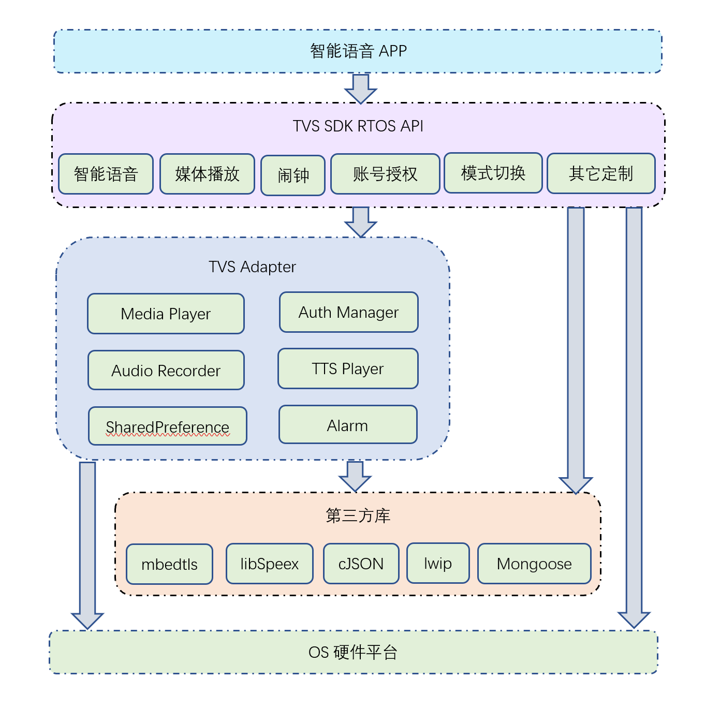

# TVS SDK FreeRTOS接入指南

## 一. SDK简介

#### 1.功能介绍

TVS SDK FreeRTOS是FreeRTOS平台上基于TVS（Tencent Voice Service）云端API协议的软件开发包，可以帮助开发者快速接入TVS。




TVS SDK需要依赖接入方提供如下的功能：

 - 配置参数、闹钟信息、授权信息等的持久化；
 - 流媒体和TTS音频数据的播放和控制功能；
 - 语音录制功能；
 - 系统闹钟的设置、振铃等功能；
 - mbedtls、lwip、libSpeex、Mongoose和cJSON库支持；

由于FreeRTOS系统API本身没有提供这些功能，而在不同的芯片方案中，这些功能的接口各不相同。
所以，SDK抽象了一套适配层接口，由各个芯片方案的方案商来实现，作为TVS Adapter层，提供给SDK所需要的能力。

下面对这个层次的各个子模块的接入流程进行一些讲解。


#### 2.运行硬件要求：

- CPU频率建议单核196MHz以上

- 内存建议预留200k以上（多核方案，前端音频模块和TTS、网络流媒体解码和播放模块均工作在另一个核上的情况，可以放宽到最低100k左右）

- 需要SD卡或者内部Flash等存储模块支持

  

#### 3.已适配平台

##### 1) RTOS系统

全志XR871、MTK7697等芯片方案

##### 2) Linux系统

如果要支持其他方案，需要联系腾讯，并发送该方案的交叉编译工具、开发SDK和demo，以及开发板、规格书、开发文档，供腾讯一侧将TVS SDK FreeRTOS移植到该方案上，并发布对应的lib库和SDK Demo，之后即可遵循本文档进行进一步适配。

#### 4. 编译环境要求

Linux系统 4.15及以上 或者Ubunutu 16.04及以上

1.安装cmake工具

2.更新系统工具: 

sudo apt-get install lsb-core

sudo apt-get install lib32ncurses5-dev

## 二、编译方法

编译方法可以参考《[TVS SDK RTOS编译指南](./TVS%20SDK%20RTOS编译指南.md)》

## 三、SDK文件夹结构

### 1、tvs_sdk\tvs_api

此文件夹下包含TVS SDK的所有头文件：

- tvs_platform_adapter.h
  提供了Platform adapter的接口；
- tvs_media_player_adapter.h
  提供了Media Player Adapter的接口；
- tvs_alert_adater.h
  提供了Alert Adapter的接口；
- tvs_api.h
  提供了TVS初始化、发起智能语音、播控切换等功能函数；涵盖了TVS SDK的主要功能；
- tvs_authorize.h
  提供了授权接口；

### 2、 tvs_sdk\tvs_libs  

此文件夹下包括TVS SDK的库文件：

- libtvscore.a
  TVS SDK库文件；

### 3、 tvs_demo\tvs_adapter  

此文件夹下包括TVS Adapter的实现示例：

- tvs_api_impl.c
  实现了SDK初始化流程；
  
- tvs_media_player_impl.c
  实现了Media Player Adapter；
  
- tvs_alert_impl.c
  实现了Alert Adapter；
  
- tvs_platform_impl.c
  实现了Platform Adapter；
  
- tvs_auth_manager.c
  实现了授权流程；
  
  

## 四、第三方库支持

TVS SDK FreeRTOS需要如下几个第三方库支持：

- cJSON

  JSON库

- libSpeex

  speex音频解压库

- Mongoose

  http client库

- lwip

  提供了TCP/IP功能

- mbedtls

  提供了TLS加密功能，为https提供加解密

接入方需要将这几个第三方库集成到自己的ROM中。

其中Speex在编译的时候需要设置如下参数：
```
CFLAGS += -DFIXED_POINT -DEXPORT="" -DMAX_CHARS_PER_FRAME=100 -DNB_ENC_STACK=10000 -UHAVE_CONFIG_H
```


## 五、账号授权

### 1、注册开发者和产品信息

在开放平台上注册开发者账号，并注册产品信息，申请产品对应的appKey和accessToken，按照下列格式组合成Product ID字符串：

```
appkey:accessToken
```

例如：

```c
const char* produce_id = 	               "788ea1a0a54511e891242df7a86ac154:7fbdf35014824f75ad9afa32dee3dbe7";
```

### 2、确定授权方式

云端后台需要设备端进行授权，授权成功后，才能正常使用她所提供的服务。

授权分为两种类型：

- 访客授权

仅需要本产品对应的Product ID、设备的唯一标识（DSN）即可使用访客授权；访客授权只能使用受限的功能（比如无法访问音乐资源）；

- 设备授权

设备授权，需要当前设备与手机APP建立连接，由手机端拉取设备的DSN、Product ID，结合用户输入的账号信息，编码并生成Client ID字符串，同步到设备端，才能触发设备授权流程。

手机APP必须集成云小微手机端SDK。

APP与设备端的传输通道，一般使用经典蓝牙、BLE、WIFI AP等方式，由接入方自己实现。

### 3、TVS Adapter的授权实现

TVS Adapter为访客授权和设备授权搭建了一个基本框架，见tvs_adapter/tvs_auth_manager.c；

接入方需要按照产品的实际情况完善这个框架，流程如下：

#### 3.1 CONFIG_USE_GUEST_AUTHORIZE宏

这个宏是访客授权/设备授权的切换开关，设置为1，代表访客授权，设置为0，代表设备授权。按照当前产品的实际需求选择授权方式；

#### 3.2 实现授权信息的存储

tvs_auth_manager.c预留了如下函数，用于在授权成功时，对授权信息进行持久化：

```c
void save_auth_info(char* account_info, int len)
```

account_info时一个json字符串，len为字符串长度，接入方需要为account_info预留出1k的存储空间；

接入方需要实现这个函数，将授权信息保存到flash中。

注意，TVS Adapter在初始化的时候将自动调用此函数，接入方无需主动调用；

#### 3.3 实现授权信息的加载

tvs_auth_manager.c预留了如下函数，用于在开机初始化授权模块时，读取之前存储的授权信息：
```c
char* load_auth_info(int* len) 
```

接入方需要实现此函数，返回授权信息字符串以及其长度；

如果加载错误，则返回 NULL

注意，TVS Adapter在初始化的时候将自动调用此函数，接入方无需主动调用；

#### 3.4 填写product id和DSN

将product id和设备的DSN填写到init_authorize_on_boot函数中；

#### 3.5 实现访客授权

完成3.4节的操作，且CONFIG_USE_GUEST_AUTHORIZE设置为1，便完成了访客授权的流程，在这种授权方式中，DSN代表了每台设备的唯一性，接入方需要在量产后，保证每台设备的DSN不重复；

#### 3.6 实现账号授权

- 设备端进入配网模式，一般是采用物理按键组合的方式进入；

- 手机APP（集成了云小微手机SDK）登陆账号（QQ、微信、第三方账号登陆）；

- 设备端与手机APP进行连接，准备交换数据；

- 手机APP从设备端拉取设备的product id、DSN；

- 手机APP调用云小微SDK，生成client ID，这个步骤需要传入账号信息、product id以及DSN；

- 手机APP发送client ID到设备端
- 设备端调用start_authorize_with_client_id进行授权
- SDK将回调my_authorize_callback函数，同步授权结果，授权成功将调用save_auth_info存储授权信息；
- 如果当前网络未连接，那么在网络连接成功后，SDK会自动进行授权；

在调试阶段，如果还没有传输通道，可以实现一个控制台指令来完成授权操作：

- 使用云小微的手机APP进行账号登陆，输入product ID和DSN，生成client ID并拷贝到剪贴板

- 通过微信文件助手将client ID传到PC端，

- 将client ID复制到控制台，调用start_authorize_with_client_id进行授权；

授权成功，调用save_auth_info存储授权信息后，以后每次开机都会加载授权信息，自动向服务器授权，无需再进行配网操作。

#### 3.7 云小微手机端SDK

在如下链接中下载手机端SDK的代码、文档和示例：

https://github.com/TencentDingdang/dmsdk


## 六、配置QUA

### 1、概述

QUA中包含了设备端的各种信息，包含了设备的版本信息，设备的产品包名（用于区分不同产品的唯一标识），需要接入方在初始化SDK的填入，SDK将在访问后台的时候携带此信息，后台可以根据这些信息，区分不同的产品，不同的版本，实现接入方的一些定制需求；

### 2、设置QUA

在初始化SDK的时候传入QUA所需要的信息：

```c
tvs_product_qua qua = {0};
// 设备端版本号
qua.version = "1.0.0.1000";
// 设备端包名
qua.package_name = "com.tencent.tvs.demo";

tvs_api_init(&api_callback, &config, &qua);
```
返回值如下：

| 错误号 | Key                | 含义 | 错误说明         |
| ------ | ------------------ | ---- | ---------------- |
| 0      | TVS_API_ERROR_NONE | 成功 | 接口调用成功     |
| 30111  | 参考通用错误说明   | 失败 | 参考通用错误说明 |

### 3、设置终端版本号

终端版本号必须为4段，每一段为一个数字，各个数字之间用"."分开，例如：1.0.1.1000；新的版本号必须比旧版本号大，例如2.0.1.101 > 2.0.1.100 > 1.0.1.1011 > 1.0.1.1000；

这个字段建议结合日期以及一个自增的build number来组合：

{最大版本号}.{最小版本号}.{日期}.{build number}

例如

1.0.190607.101

1.0.190625.104

2.0.190701.15

等等。

### 4、设置包名

接入方需要为自己的产品规划一个包名，并同步给腾讯一侧。接入方的不同型号产品，包名一定要有差异。


## 七、初始化TVS Adapter

tvs_api_impl.c中提供了一个初始化函数tvs_api_impl_init，对整个SDK各个模块进行了初始化，接入方需要在设备端应用的main函数中调用：
```c
#include "tvs_api_impl.h"

int main(void)
{
    system_init();
    wifi_init(&config, NULL);
    fs_init();
    wifi_event_listen();
	......
        
    // 初始化TVS Adapter    
	tvs_api_impl_init();
    
	......
	for ( ;; );
}
```


## 八、同步网络连接状态

SDK需要监听网络状态变化，在终端能够访问外网，以及与外网断开连接的情况下，能够得到通知，故SDK定义了如下函数，由TVS Adapter层调用：

```c
void tvs_platform_adapter_on_network_state_changed(bool connect);
```

TVS Adapter层需要监听网络连接状态，在终端通过2/3/4G网络或者WIFI连上外网的时候，调用此函数并设置connect为true；在终端与网络断开连接的时候，调用此函数并设置connect为false；

需要注意的是，有的终端能够配置为AP模式，并由其他设备与自己连接，此时也会发送网络已连接的事件，但是此时并不能连上外网，故不能调用tvs_platform_adapter_on_network_state_changed(true)。TVS Adapter需要跟进终端具体功能，区分一下这种场景。

举例：

```c
static void net_ctrl_msg_callback(uint32_t event, uint32_t data, void *arg) {
	uint16_t type = EVENT_SUBTYPE(event);
	switch (type) {
	case NET_CTRL_MSG_NETWORK_UP:
		if (g_net_config_mode) {
			// AP配网模式不能连接外网
			break;
		}
		// 网络连接成功后通知SDK
		tvs_platform_adapter_on_network_state_changed(true);
		break;
	case NET_CTRL_MSG_WLAN_CONNECT_FAILED:
	case NET_CTRL_MSG_WLAN_DISCONNECTED:
	case NET_CTRL_MSG_CONNECTION_LOSS:
	case NET_CTRL_MSG_NETWORK_DOWN:
		// 网络断开时通知SDK
		tvs_platform_adapter_on_network_state_changed(false);
		break;
	default:
		break;
	}
}
```


## 九、实现录音功能

### 1、选择录音参数

SDK支持采样率为8000hz和16000hz的录音参数；

使用8000hz采样率，CPU占用率低，识别准确率比16000hz略低，适用于一些性能比较差的平台；

使用16000hz采样率，CPU占用率相对高，识别准确率相对高，适用于一些性能较好的平台；

在初始化SDK的时候，可以在tvs_api_impl.c中，对采样率进行选择：

```c
tvs_default_config config = {0};
......
// 设置采样率
config.recorder_bitrate = 16000;
config.recorder_channels = 1;
tvs_api_init(&api_callback, &config, &qua);
```

返回值如下：

| 错误号 | Key                | 含义 | 处理建议         |
| ------ | ------------------ | ---- | ---------------- |
| 0      | TVS_API_ERROR_NONE | 成功 | 接口调用成功     |
| 非0    | 参考通用错误说明   | 失败 | 参考通用错误说明 |

### 2、实现录音模块的开启

接入方需要在tvs_platform_impl.c中实现如下函数：
```c
int tvs_media_recorder_impl_open(int bitrate, int channel) {
	// TO-DO 打开声卡，准备录制，用于智能语音对话阶段
	printf("*******start recording, bitrate %d, channel %d*******\n", bitrate, channel);
	return 0;
}
```

bitrate和channel为初始化时候传入的录制参数，这个函数返回0代表开启成功，返回-1代表开始失败；

返回值说明如下：

| 错误号 | Key                  | 含义       | 处理建议         |
| ------ | -------------------- | ---------- | ---------------- |
| 0      | TVS_API_ERROR_NONE   | 成功       | 接口调用成功     |
| -1     | TVS_API_ERROR_OTHERS | 一般性错误 | 参考通用错误说明 |

注意，TVS Adapter在录音阶段将自动调用此函数，接入方无需主动调用；

### 3、实现录音模块的关闭

接入方需要在tvs_platform_impl.c中实现如下函数：
```c
void tvs_media_recorder_impl_close() {
	// TO-DO 录制结束，关闭声卡，用于智能语音对话阶段
	printf("*******stop recording*******\n");
}
```
注意，TVS Adapter在录音阶段将自动调用此函数，接入方无需主动调用；

### 4、实现PCM数据的读取

接入方需要在tvs_platform_impl.c中实现如下函数：
```c
static int tvs_media_recorder_impl_read(void *buffer, unsigned int buffer_len) {
	// TO-DO 录制PCM，填充buffer，用于智能语音对话阶段
	return buffer_len;
}
```
这个函数返回PCM的字节数；

返回值说明：

| 错误号 | Key                  | 含义                    | 处理建议     |
| ------ | -------------------- | ----------------------- | ------------ |
| 大于0  |                      | 这个函数返回PCM的字节数 | 接口调用成功 |
| -1     | TVS_API_ERROR_OTHERS | 一般性错误              | 录音启动失败 |

注意，TVS Adapter在录音阶段将自动调用此函数，接入方无需主动调用；

### 5、TVS Adapter的录音默认实现

由于各个平台的录音接口不一致，故Demo中使用了从全局数组中读取PCM数据并发送到云端识别的方式，仅用于演示。

可以使用Bin2C等文件转C数组的工具，将wav文件转换，并替换weather_test.c中的acweather数组的内容。

## 十、实现播放TTS功能

### 1、配置TTS输出格式

在TTS阶段，云端将会返回mp3格式的数据，SDK将会通过回调，将TTS数据传递给外层；

接入方可以配置SDK，直接将mp3数据传到外层，通过平台播放器进行播放，也可以让SDK对mp3数据进行解码，将PCM和采样率、声道数等参数传到外层。

TVS Adapter层提供了一个CONFIG_DECODE_TTS_IN_SDK宏，设置为1，SDK将对mp3进行解码；设置为0，SDK将直接将mp3数据传到外层。

### 2、SDK解码

#### 2.1 配置由SDK解码

修改CONFIG_DECODE_TTS_IN_SDK宏，设置其值为1，SDK将对mp3进行解码并输出PCM数据；

#### 2.2 实现PCM播放模块的开启

接入方需要在tvs_platform_impl.c中实现如下函数：

```c
static int tvs_soundcard_player_open(int bitrate, int channels) {
	// TO-DO 打开声卡，准备播放PCM，用于TTS播放阶段
	printf("*******stop playing tts, bitrate %d, channel %d*******\n", bitrate, channel);
	return 0;
}
```
返回-1代表声卡开启失败；

返回值说明如下：

| 错误号 | Key                  | 含义       | 处理建议     |
| ------ | -------------------- | ---------- | ------------ |
| 0      | TVS_API_ERROR_NONE   | 成功       | 接口调用成功 |
| -1     | TVS_API_ERROR_OTHERS | 一般性错误 | 打开声卡失败 |

注意，TVS Adapter在TTS阶段将自动调用此函数，接入方无需主动调用；

#### 2.3 实现PCM播放模块的关闭

接入方需要在tvs_platform_impl.c中实现如下函数：

```c
static void tvs_soundcard_player_close() {
	// TO-DO 播放PCM结束，关闭声卡，用于TTS播放阶段
	printf("*******stop playing tts*******\n");
}
```
注意，TVS Adapter在TTS阶段将自动调用此函数，接入方无需主动调用；

#### 2.4 实现PCM数据的播放

接入方需要在tvs_platform_impl.c中实现如下函数：

```c
static int tvs_soundcard_player_write(void *data, unsigned int data_bytes) {
	// TO-DO 播放PCM，用于TTS播放阶段
	//printf("*******playing, data size %d*******\n", data_bytes);
	return data_bytes;
}
```
返回-1代表播放失败；

| 错误号 | Key                  | 含义                  | 处理建议     |
| ------ | -------------------- | --------------------- | ------------ |
| 大于0  |                      | 播放成功,播放的字节数 | 接口调用成功 |
| -1     | TVS_API_ERROR_OTHERS | 一般性错误            | 录音启动失败 |

注意，TVS Adapter在TTS阶段将自动调用此函数，接入方无需主动调用；

### 3、外层解码
某些平台实现了播放mp3数据流的能力，可以配置SDK，输出mp3数据，由平台播放器来实现播放功能；
外层解码的待实现接口在tvs_mediaplayer_impl.c中；

#### 3.1 配置由外层解码MP3

修改CONFIG_DECODE_TTS_IN_SDK宏，设置其值为0，SDK将直接将流式的mp3数据传到外层，由外层进行MP3解码并播放；

#### 3.2 TTS Mp3数据开始下发
一轮语音会话如果有TTS数据下发，SDK将调用on_play_tts_start通知外层准备开始播放：
```c
int on_play_tts_start(int type);
```
type是个预留参数，可以不用关注；
接入方需要实现此函数，初始化解码和播放模块，准备开始播放mp3流。

返回值说明：

| 错误号 | Key                  | 含义                  | 处理建议     |
| ------ | -------------------- | --------------------- | ------------ |
| 0      | TVS_API_ERROR_NONE   | 播放成功,播放的字节数 | 接口调用成功 |
| -1     | TVS_API_ERROR_OTHERS | 一般性错误            | 启动播放失败 |

#### 3.3 TTS Mp3数据下发结束
后台完成下发TTS数据之后，SDK将会调用on_play_tts_stop并设置force_stop为false；

```c
void on_play_tts_stop(bool force_stop);
```
接入方需要在这种情况下，在此函数中阻塞等待TTS播放完毕；

#### 3.4 强制停止TTS播放
一般在打断唤醒的时候，SDK将强制停止上一次TTS播放，将会调用on_play_tts_stop并设置force_stop为true。
接入方需要在这种情况下，不管tts数据是否播放完毕，均要强制停止播放；

#### 3.5 下发TTS Mp3流

接入方需要实现如下函数，获取MP3流数据；SDK将会多次调用此函数，下发MP3给外层。

```c
int on_play_tts_recv_data(char* data, int data_len);
```

这个函数需要返回实际播放的字节数，返回值小于0代表播放失败，SDK将会停止数据下发。

返回值说明：

| 错误号 | Key                  | 含义                  | 处理建议     |
| ------ | -------------------- | --------------------- | ------------ |
| 大于0  |                      | 播放成功,播放的字节数 | 接口调用成功 |
| -1     | TVS_API_ERROR_OTHERS | 一般性错误            | 播放失败     |

## 十一、实现网络流媒体播放

### 1、概述

通过语音发布播放音乐的指令，后台将会返回对应的网络流媒体的相关信息；

播放歌曲必须使用设备授权，并确保自己的bot勾选了音乐技能；

### 2、实现set source


当TVS SDK在智能语音对话、云端媒体播控等情况下（比如通过语音说“播放一首儿歌”等指令，或者在终端配套的手机APP上点播了一首歌曲等，或者执行了切换下一首歌曲、下一个专辑等指令），会收到云端下发的媒体播放指令，此时，SDK将从指令中解析出对应的流媒体url、流媒体token以及需要seek的offset，调用set\_source，准备播放对应流媒体。

TVS Adapter在tvs_mediaplayer_impl.c中提供了如下函数：

```c
static int mediaplayer_adapter_set_source(const char* url, const char* token, uint32_t offset_sec) {...}
```

接入方需要需要实现这个函数，将待播放的媒体url和offset设置给平台媒体播放器。

返回值说明：

| 错误号 | Key                  | 含义         | 处理建议         |
| ------ | -------------------- | ------------ | ---------------- |
| 0      | TVS_API_ERROR_NONE   | 启动播放成功 | 接口调用成功     |
| -1     | TVS_API_ERROR_OTHERS | 一般性错误   | 检查参数是否合法 |

### 3、实现start play

当TVS SDK在完成了一轮智能语音对话、云端媒体播控等流程后，进入空闲状态，如果在此次流程中下发了媒体播放指令（set_source之后），SDK将会调用start_play函数，通知平台媒体播放器，可以开始播放该流媒体；

TVS Adapter在tvs_mediaplayer_impl.c中提供了如下函数：

```c
static int mediaplayer_adapter_start_play(const char* token) {  ... }
```

接入方需要在这个函数中，调用平台媒体播放器，播放set_source函数下发的流媒体url，并从offsetInSeconds的位置开始播放；

返回值说明：

| 错误号 | Key                  | 含义         | 处理建议         |
| ------ | -------------------- | ------------ | ---------------- |
| 0      | TVS_API_ERROR_NONE   | 启动播放成功 | 接口调用成功     |
| -1     | TVS_API_ERROR_OTHERS | 一般性错误   | 检查参数是否合法 |

### 4、实现stop play

当设备正在播放一首从云端下发的流媒体的时候，用户可以通过说”停止播放“、”暂停播放“等指令，停止当前的媒体播放，此时云端会下发停止播放的指令，SDK将调用stop_play方法。

TVS Adapter在tvs_mediaplayer_impl.c中提供了如下函数：

```c
static int mediaplayer_adapter_stop_play(const char* token)
```

接入方需要在此函数中，调用平台媒体播放器的停止功能。

停止之后，用户可以通过说”继续播放“来通知平台播放器继续播放此媒体，此时SDK将再次调用set_source，其offset参数为停止时的进度。

返回值说明：

| 错误号 | Key                  | 含义         | 处理建议         |
| ------ | -------------------- | ------------ | ---------------- |
| 0      | TVS_API_ERROR_NONE   | 停止播放成功 | 接口调用成功     |
| -1     | TVS_API_ERROR_OTHERS | 一般性错误   | 检查参数是否合法 |

### 5、实现pause play

pause操作，仅仅是在SDK进入忙状态，比如说点击录音按钮开始智能语音对话、点击上一首/下一首按钮开始切换歌曲等情况下，需要短时间暂停当前的播放，以让出资源供SDK执行录音、播放TTS等操作。

如果在开始录音的时候，设备并未播放云端下发的流媒体，那么SDK将不会回调pause_play接口。

TVS Adapter在tvs_mediaplayer_impl.c中提供了如下函数：

```c
static int mediaplayer_adapter_pause_play(const char* token);
```

接入方需要在此函数中，调用平台播放器的暂停功能。

返回值说明：

| 错误号 | Key                  | 含义         | 处理建议         |
| ------ | -------------------- | ------------ | ---------------- |
| 0      | TVS_API_ERROR_NONE   | 暂停播放成功 | 接口调用成功     |
| -1     | TVS_API_ERROR_OTHERS | 一般性错误   | 检查参数是否合法 |

### 6、实现resume play

resume操作，在SDK退出忙状态，比如说智能语音对话结束等情况下，会调用此接口，继续播放之前的流媒体。

如果在开始录音的时候，设备并未播放云端下发的流媒体，那么SDK将不会回调resume_play接口.

TVS Adapter在tvs_mediaplayer_impl.c中提供了如下函数：

```c
static int mediaplayer_adapter_resume_play(const char* token);
```

返回值说明：

| 错误号 | Key                  | 含义         | 处理建议         |
| ------ | -------------------- | ------------ | ---------------- |
| 0      | TVS_API_ERROR_NONE   | 继续播放成功 | 接口调用成功     |
| -1     | TVS_API_ERROR_OTHERS | 一般性错误   | 检查参数是否合法 |

### 7、实现get offset

云端需要知道当前网络流媒体的播放进度，在开始录音、播放状态改变等情况下，会将播放进度作为上下文传递给后台，故将会回调get_offset接口，获取当前媒体的播放进度。

TVS Adapter在tvs_mediaplayer_impl.c中提供了如下函数：

```c
static int mediaplayer_adapter_get_offset(const char* token);
```

接入方需要实现此函数，获取播放器的播放进度；

需要注意的是，TVS Adapter在执行了stop_play之后，需要保存此时播放进度，在每次回调get_offset的时候传给SDK，直到下一次set_source被调用才可重置，以便在之后执行”继续播放“的时候，能从后台下发的指令中获取到正确的offset。

返回值说明：

| 错误号 | Key                  | 含义             | 处理建议         |
| ------ | -------------------- | ---------------- | ---------------- |
| 0      | TVS_API_ERROR_NONE   | 读取播放进度成功 | 接口调用成功     |
| -1     | TVS_API_ERROR_OTHERS | 一般性错误       | 检查参数是否合法 |

### 8、同步播放状态

当云端下发了一个网络流媒体之后，平台播放器将播放此流媒体，接入方需要监听平台播放器的状态，将状态同步给SDK和云端后台。

在该网络流媒体开始播放的时候，接入方需要主动调用如下函数：
```c
void tvs_mediaplayer_adapter_on_play_started(const char* token);
```
在该网络流媒体停止或者播放出错的时候，接入方需要主动调用如下函数：
```c
void tvs_mediaplayer_adapter_on_play_stopped(int error_code, const char* token);
```
在该网络流媒体播放结束的时候，接入方需要主动调用如下函数：
```c
void tvs_mediaplayer_adapter_on_play_finished(const char* token);
```
在该网络流媒体暂停播放的时候，接入方需要主动调用如下函数：
```c
void tvs_mediaplayer_adapter_on_play_paused(const char* token);
```

token为set source阶段下发的媒体唯一标识。

### 9、通过物理按键操作

除了通过语音发布播放音乐指令之外，SDK也支持通过物理按键切换到上一首/下一首歌曲，前提是之前已经通过语音播放了一首网络流媒体；


#### 9.1 切到上一首

SDK提供了如下接口供外层主动调用，切到到媒体列表的上一个媒体：

```c
int tvs_api_playcontrol_previous();
```

返回值说明：

| 错误号 | Key                | 含义 | 处理建议         |
| ------ | ------------------ | ---- | ---------------- |
| 0      | TVS_API_ERROR_NONE | 成功 | 接口调用成功     |
| 非0    | 参考通用错误说明   | 失败 | 参考通用错误说明 |

#### 9.2 切到下一首

SDK提供了如下接口供外层主动调用，切到到媒体列表的下一个媒体：

```c
int tvs_api_playcontrol_next();
```

返回值说明：

| 错误号 | Key                | 含义 | 处理建议         |
| ------ | ------------------ | ---- | ---------------- |
| 0      | TVS_API_ERROR_NONE | 成功 | 接口调用成功     |
| 非0    | 参考通用错误说明   | 失败 | 参考通用错误说明 |

### 9.3 SDK之外的暂停/停止/继续功能

有的接入方案中，可以不经过SDK的智能语音功能（通过语音说暂停播放/继续播放等语料），来实现暂停/继续功能，比如有对应的物理按键、对应的本地命令词等，为了与SDK中的媒体状态机保持状态同步，可以遵循如下流程：

- 本地暂停/停止播放音乐后，调用tvs_mediaplayer_adapter_on_play_stopped通知SDK
- 本地继续播放音乐，调用tvs_mediaplayer_adapter_on_play_started通知SDK
- 注意这个暂停/停止/继续指的时本章节第4小节的stop play, 而非第

## 十二、实现Preference功能

SDK需要持久化一些配置数据，需要Adapter提供保存/读取配置数据的能力：

接入方需要实现tvs_platform_impl.c中的如下函数：
```c
const char* tvs_platform_impl_load_preference(int* preference_size) {
	// TO-DO 将保存的preference加载出来，需要通过malloc申请内存，SDK在回调此函数后，会调用free来执行清除操作
	return "";
}

int tvs_platform_impl_save_preference(const char* preference, int preference_size) {
	// TO-DO 保存preference，preference参数为一个json字符串
	return 0;
}
```

preference是一个Json字符串，接入方需要至少为preference预留出8K的存储空间；

如果读取失败，则返回NULL

保存返回值说明：

| 错误号 | Key                | 含义 | 处理建议         |
| ------ | ------------------ | ---- | ---------------- |
| 0      | TVS_API_ERROR_NONE | 成功 | 接口调用成功     |
| 非0    | 参考通用错误说明   | 失败 | 参考通用错误说明 |

## 十三、实现闹钟功能

### 1、 实现新增闹钟功能

接入方需要在tvs_alert_impl.c中实现如下函数：
```c
static int tvs_alert_adapter_impl_new(tvs_alert_infos* alerts, int alert_count) {
	// TO-DO 保存闹钟
	return 0;
}
```
云端下发闹钟的时候，SDK将调用此函数来保存闹钟；

返回值说明：

| 错误号 | Key                | 含义 | 处理建议         |
| ------ | ------------------ | ---- | ---------------- |
| 0      | TVS_API_ERROR_NONE | 成功 | 接口调用成功     |
| 非0    | 参考通用错误说明   | 失败 | 参考通用错误说明 |

### 2、 实现删除闹钟功能
接入方需要在tvs_alert_impl.c中实现如下函数：
```c
static int tvs_alert_adapter_impl_delete(tvs_alert_summary* alerts, int alert_count) {
	// TO-DO 删除闹钟
	return 0;
}
```
云端下发闹钟删除事件的时候，SDK将调用此函数来删除本地闹钟；

返回值说明：

| 错误号 | Key                | 含义 | 处理建议         |
| ------ | ------------------ | ---- | ---------------- |
| 0      | TVS_API_ERROR_NONE | 成功 | 接口调用成功     |
| 非0    | 参考通用错误说明   | 失败 | 参考通用错误说明 |

##### 2.3.3 实现读取闹钟功能
接入方需要在tvs_alert_impl.c中实现如下函数：
```c
void* tvs_alert_adapter_impl_get_all_alerts() {
	cJSON* alert_arr = cJSON_CreateArray();
	// TO-DO 获取闹钟概要信息并填充json，必须返回cJSON*类型的数据

	return alert_arr;
}
```
用户可以通过UI操作、配套APP操作闹钟，云端后台将会统一维护和汇总多端的闹钟信息，所以在发起语音会话的时候，云端要求终端上传所有闹钟的概要信息，包括时间、token和类型，此时终端SDK将会调用此函数。
闹钟汇总信息的格式为一个Json字符串，格式如下：

```
[{
	"token": "{{STRING}}",
	"type": "{{STRING}}",
	"scheduledTime": "{{STRING}}"
},
{
	"token": "{{STRING}}",
	"type": "{{STRING}}",
	"scheduledTime": "{{STRING}}"
}]
```

##### 2.3.4 同步闹钟状态

闹钟振铃的时候，接入方需要主动调用如下函数通知SDK和后台：

```c
int tvs_alert_adapter_on_trigger(const char* alert_token);
```

返回值说明：

| 错误号 | Key                | 含义 | 处理建议         |
| ------ | ------------------ | ---- | ---------------- |
| 0      | TVS_API_ERROR_NONE | 成功 | 接口调用成功     |
| 非0    | 参考通用错误说明   | 失败 | 参考通用错误说明 |

闹钟振铃结束的时候，接入方需要主动调用此函数通知SDK和后台：

```c
int tvs_alert_adapter_on_trigger_stop(const char* alert_token, tvs_alert_stop_reason reason);
```

返回值说明：

| 错误号 | Key                | 含义 | 处理建议         |
| ------ | ------------------ | ---- | ---------------- |
| 0      | TVS_API_ERROR_NONE | 成功 | 接口调用成功     |
| 非0    | 参考通用错误说明   | 失败 | 参考通用错误说明 |

## 十四、实现设置音量功能

在通过智能语音对话功能发起设置音量的动作时，比如“音量调整到50”、“把音量调大些”、“音量调小一点”等语料的时候，后台将发布音量切换指令，SDK收到此指令后，将通知接入方调整设备的音量值。

可以在TVS Adapter的tvs_platform_impl.c中修改tvs_platform_impl_set_current_cloud_volume函数，调用平台的音量设置接口，在后台发布音量调节事件的时候，将音量值设置给声卡：


```c
int tvs_platform_impl_set_current_cloud_volume(int cloud_volume, 
                                               int cloud_max_value, bool do_init) {
	if (cloud_volume > cloud_max_value) {
		cloud_volume = cloud_max_value;
	}

    // 将云端音量转换为设备音量，MAX_VOLUME为当前设备音量最大值，MIN_VOLUME为设备音量最小值
    // cloud_max_value固定取值为100
	int device_volume = 
        ((MAX_VOLUME - MIN_VOLUME) * cloud_volume / cloud_max_value) + MIN_VOLUME;
    // 设置设备音量
	set_device_volume(device_volume);
	
	return 0;
}
```

云端音量cloud_volume是一个百分百值，取值0到100，云端音量和当前设备音量的转换公式为：

当前设备音量 = （设备音量最大值 - 设备音量最小值） * 云端音量 / 100 + 设备音量最小值；

云端音量 = （当前设备端音量 - 设备音量最小值） * 100 / （设备音量最大值 - 设备音量最小值）；

返回值说明：

| 错误号 | Key                | 含义 | 处理建议         |
| ------ | ------------------ | ---- | ---------------- |
| 0      | TVS_API_ERROR_NONE | 成功 | 接口调用成功     |
| 非0    | 参考通用错误说明   | 失败 | 参考通用错误说明 |

SDK需要监听系统音量改变的事件，故定义了如下函数，由TVS Adapter层调用：

```c
void tvs_platform_adapter_on_volume_changed(int cloud_volume)
```

TVS Adapter需要注册对系统音量改变的监听器，在音量改变的时候，将设备音量转换为云端音量，调用此函数通知SDK和后台。


## 十五、启动智能语音对话

### 1、SDK自主录音

在一般情况下，SDK发起智能语音对话，是通过响应物理按钮的点击事件触发，调用如下函数：

```c
/**
 * @brief 开启智能语音对话
 *
 * @param 
 * @return 为0代表开启成功，其他值代表失败，见TVS_API_ERROR_*
 */
int tvs_api_start_recognize();
```

返回值说明：

| 错误号 | Key                           | 含义                    | 处理建议                                       |
| ------ | ----------------------------- | ----------------------- | ---------------------------------------------- |
| 0      | TVS_API_ERROR_NONE            | 成功                    | 接口调用成功                                   |
| -1     | TVS_API_ERROR_OTHERS          | 一般错误                | 具体函数说明                                   |
| -4     | TVS_API_ERROR_NOT_ATHORIZED   | 当前终端未鉴权          | 检查product_id及dsn是否设置，及授权api是否调用 |
| -5     | TVS_API_ERROR_NETWORK_INVALID | 当前终端网络连接异常    | 检查网络是否连通                               |
| -7     | TVS_API_ERROR_NOT_RUNNING     | 由于终端SDK处于STOP状态 | 检查是否调用                                   |

调用这个函数，会立刻中止当前正在进行的智能语音对话，并开启一轮新的对话流程。

如果要立即停止录音并开始识别，可以调用如下函数：

```c
/**
 * @brief 中止当前的智能语音对话的录音流程，并立即开始识别
 *
 * @param 
 * @return 为0代表开功，其他值代表失败，见TVS_API_ERROR_*
 */
int tvs_api_stop_recognize();
```

返回值说明：

| 错误号 | Key                | 含义 | 处理建议         |
| ------ | ------------------ | ---- | ---------------- |
| 0      | TVS_API_ERROR_NONE | 成功 | 接口调用成功     |
| 非0    | 参考通用错误说明   | 失败 | 参考通用错误说明 |

如果要立刻停止当前的智能语音对话流程（不发送识别），可以调用如下函数：

 ```c
/**
 * @brief 中止当前正在进行的智能语音对话、播放控制等活动
 *
 * @param 
 * @return 为0代表成功，其他值代表失败，见TVS_API_ERROR_*
 */
 int tvs_api_stop_all_activity();
 ```

 返回值说明：

| 错误号 | Key                | 含义 | 处理建议         |
| ------ | ------------------ | ---- | ---------------- |
| 0      | TVS_API_ERROR_NONE | 成功 | 接口调用成功     |
| 非0    | 参考通用错误说明   | 失败 | 参考通用错误说明 |

### 2、外部前端音频模块触发

在某些接入商的方案中，提供了成套的前端音频模块（包括本地唤醒、录音、VAD、回声消除、降噪等），这些模块有可能工作在与SDK同一个核上，也可能工作在另一个核上，与SDK所在的核通过串口等进行通信；为了适配这几种情况，SDK提供了如下流程，见TVS Adapter中的tvs_api_impl.h：

#### 2.1 初始化

在调用tvs_api_impl_init初始化SDK之前，调用tvs_api_impl_speech_init函数；

#### 2.2 响应前端音频模块的唤醒指令

收到前端音频模块的唤醒指令后，主动调用tvs_api_impl_speech_wakeup函数；SDK将会与后台连接，准备开始进行识别；

#### 2.3 响应VAD End

收到前端音频模块的VAD End指令后，需要主动调用tvs_api_impl_speech_write_end函数；SDK将会向后台发送录音停止的指令，之后将会返回识别结果；

#### 2.4 填充PCM数据

收到前端音频模块输出的流式PCM数据后，需要主动调用tvs_api_impl_speech_write_audio函数，填充数据到SDK的录制buffer中，SDK将对这些数据进行编码，并发送给云端进行识别。

#### 2.5 监听SDK事件

腾讯后台提供了云端VAD功能，识别到上传的语音尾端点时，将会下发Stop Capture指令，可以在tvs_api_impl.c中的如下函数中获取到该事件：

```c
static void callback_on_speech_reader_stop(int session_id, int error) {
	if (tvs_api_get_current_session_id() == session_id) {
		TVS_ADAPTER_PRINTF("on reader stop, session id %d, error %d\n", session_id, error);
		// SDK发送数据结束,如果本地录音没有结束，需要通知其结束
		switch(error) {
		case TVS_API_AUDIO_PROVIDER_ERROR_NONE:
			// 语音对话正常结束
			break;
		case TVS_API_AUDIO_PROVIDER_ERROR_STOP_CAPTURE:
			// 收到云端VAD End标识
			break;
		case TVS_API_AUDIO_PROVIDER_ERROR_TIME_OUT:
			// 收到SDK Timeout标识，一般是网络原因导致HTTP超时
			break;
		case TVS_API_AUDIO_PROVIDER_ERROR_NETWORK:
			// 网络出错
			break;
		default:
			// 其他原因
			break;
		}
	}
}
```

SDK内部在网络超时、录音超时等情况下，会向外层下发Timeout事件，此事件同样可以通过callback_on_speech_reader_stop回调函数获取到。

SDK在网络连接出错的情况下，会向外层下发NETWORK Error事件，此事件同样可以通过callback_on_speech_reader_stop回调函数获取到。

在这些情况下，如果前端音频模块的本地VAD并未结束，需要主动通知该模块停止录音。

#### 2.6 例子
初始化：
```c
#include "tvs_api_impl.h"

int main(void)
{
    system_init();
    wifi_init(&config, NULL);
    fs_init();
    wifi_event_listen();
	......
	
	// 初始化
    tvs_api_impl_speech_init();
    // 初始化TVS Adapter    
	tvs_api_impl_init();
    
	......
	for ( ;; );
}
```


响应唤醒命令、VAD事件和填充音频数据：

```c
static void on_recv_voice_cmd(int cmd, const char* data, int data_size) {
	switch(cmd) {
	case VOICE_CMD_WAKEUP:
		// 收到本地唤醒指令
		tvs_api_impl_speech_wakeup();
		break;
	case VOICE_CMD_VAD_END:
		// 收到本地VAD结束标识
		tvs_api_impl_speech_write_end();
		break;
	case VOICE_CMD_DATA:
		// 收到语音数据（PCM）
		tvs_api_impl_speech_write_audio(data, data_size);
		break;
	}
}
```


## 十六、多轮对话场景

在进行智能语音对话的过程中，某些场景可能会触发多轮对话，后台将下发Expect Speech指令，要求设备端拉起一轮新的识别流程。

SDK提供了一个回调，供外层监听此事件，在tvs_api_impl.c中：

```c
static void callback_on_expect_speech() {
	printf("api impl on expect speech\n");
}
```

接入方需要实现这个函数，如果是SDK自主录音的模式，可以在此函数中调用tvs_api_start_recognize，如果是外露前端音频模块触发语音对话的模式，需要在此函数中通知前端音频模块，不经过唤醒词，直接唤醒并开始录音。


## 十七、环境切换

在调试过程中，由于后台导致的一些问题，在后台修改后不能立刻发布到正式环境，但是可以立刻发布到测试环境；接入方可以切换到测试环境尽早体验修改后的结果，在tvs_api_impl.c的tvs_api_impl_init中可以切换到测试环境：

```c
void tvs_api_impl_init() {

	...
	
	// 初始化API，设置回调监听
	tvs_api_callback api_callback = {0};
	api_callback.on_state_changed = callback_on_state_changed;
	api_callback.on_terminal_sync = callback_on_terminal_sync;
	api_callback.on_mode_changed = callback_on_mode_changed;
	api_callback.on_expect_speech = callback_on_expect_speech;
	api_callback.on_recv_tvs_control = callback_on_tvs_control;
	
	tvs_default_config config = {0};
	// 量产版本必须默认为正式环境
	config.def_env = TVS_API_ENV_NORMAL;
	// 量产版本必须默认为false
	config.def_sandbox_open = false;
	
	...
}
```

修改config.def_env的值，可以切换到测试、体验环境，具体取值为：

```c
typedef enum {
	TVS_API_ENV_TEST,       /*!< 测试环境 */
	TVS_API_ENV_NORMAL,     /*!< 正式环境 */
	TVS_API_ENV_EXP,        /*!< 体验环境 */
	TVS_API_ENV_DEV,        /*!< 开发环境 */
} tvs_api_env;
```

除此之外，如果需要打开沙箱，可以将config.def_sandbox_open设置为true；如果切换到测试环境，如非特殊情况，一定要开启沙箱；

要注意的是，正式发布的版本，必须设置为正式环境，沙箱要关闭，否则会导致问题；

接入方可以将环境和沙箱的值持久化下来，在开机的时候读取出来设置到这里，达到动态设置环境的目的；

## 十八、快速体验

1、根据第五章节，切到访客授权，保存、读取授权信息的函数暂时留空

2、根据第七章节，完成SDK初始化

3、配置WIFI ssid和PSK，启动后直接连接WIFI，并根据第八章节，对接WIFI连接/断开的事件

4、第九章节，使用Demo自带的录音默认实现

5、在tvs_api_impl.c中的初始化函数中，调用tvs_config_print_asr_result(true)，允许SDK打印ASR结果，从串口日志中搜索

"namespace":"TvsUserInterface"

可以查看ASR结果和语义返回。

6、根据第十章，选择SDK解码，对接播放PCM的接口

7、根据第十五章节，响应按键，启动智能语音对话（SDK自主录音方式）

## 十九、通用错误说明

| 错误号 | key                               | 含义                                                       | 处理建议                                       |
| ------ | --------------------------------- | ---------------------------------------------------------- | ---------------------------------------------- |
| 0      | TVS_API_ERROR_NONE                | 成功                                                       | 无                                             |
| -1     | TVS_API_ERROR_OTHERS              | 一般错误                                                   | 具体函数说明                                   |
| -2     | TVS_API_ERROR_BUSY                | 当前正处于智能语音对话或者播放控制中，无法启动             | 检查目前是否还有任务在进行                     |
| -3     | TVS_API_ERROR_MEDIAPLAYER_INVALID | 当前播放器正忙，无法启动                                   | 检查是否已经在播放                             |
| -4     | TVS_API_ERROR_NOT_ATHORIZED       | 当前终端未鉴权                                             | 检查product_id及dsn是否设置，及授权api是否调用 |
| -5     | TVS_API_ERROR_NETWORK_INVALID     | 当前终端网络连接异常                                       | 检查网络是否连通                               |
| -6     | TVS_API_ERROR_CLIENT_ID_INVALID   | 由于终端无client id，导致授权失败                          | 检查product_id及dsn是否设置                    |
| -7     | TVS_API_ERROR_NOT_RUNNING         | 由于终端SDK处于STOP状态                                    | 检查是否调用                                   |
| -8     | TVS_API_ERROR_NETWORK_ERROR       | 由于网络异常导致后台无响应                                 | 服务返回http错误                               |
| -10    | TVS_API_ERROR_NO_MORE_MEDIA       | 执行播控切换后，后台未下发媒体，一般是因为歌单播放完毕导致 | 检查歌单是否播放完成                           |
| -11    | TVS_API_ERROR_INVALID_PARAMS      | 参数错误                                                   | 检查参数是否合法                               |

