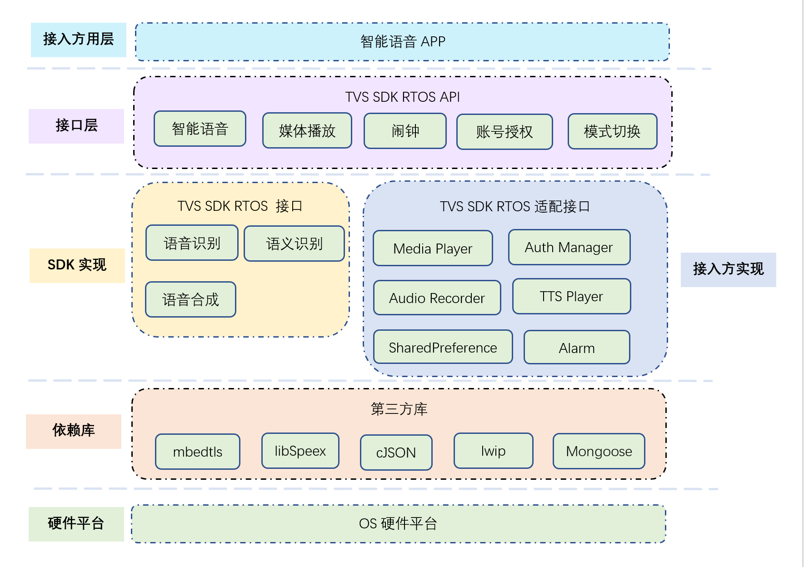
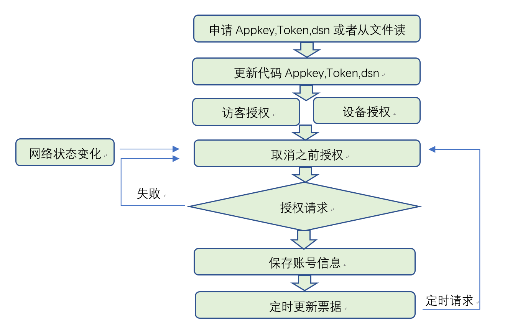
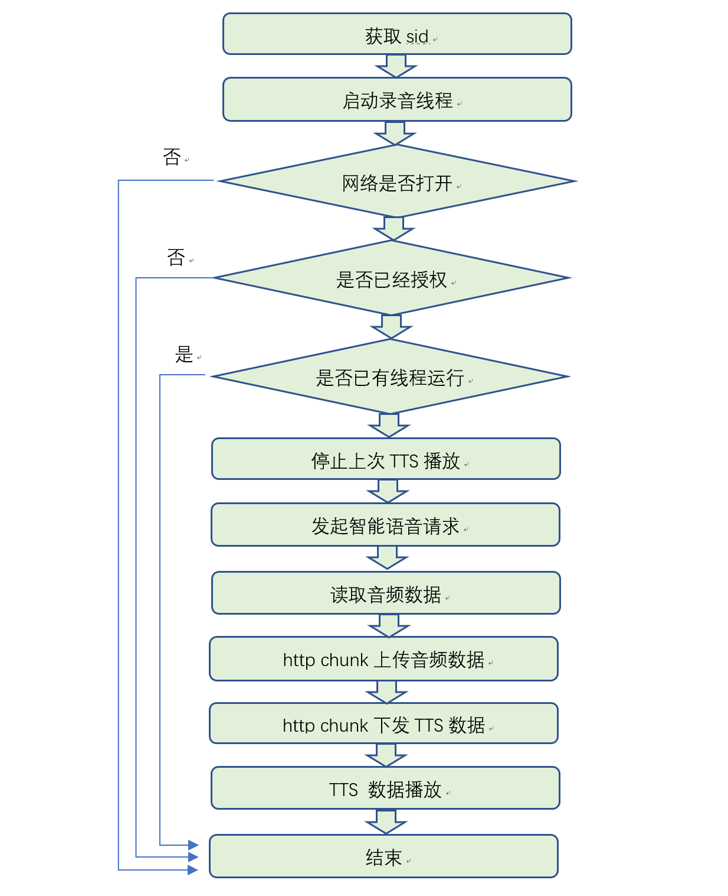

# 一.概述

TVS SDK RTOS是嵌入式平台上基于TVS（Tencent Voice Service）云端API协议的软件开发包，SDK提供了C语言的接口，帮助开发者快速接入TVS。SDK提供了语音唤醒、语音识别、媒体播放、语音合成、闹钟设置、账号授权等功能，同时提供了相关调试方法用于测试以上功能。

### 1. 名词解释

- TVS云端API：是一套基于HTTP/2的Web接口。它接收用户的语音或文本输入，传递给服务端进行处理，并将处理结果以语音、文本或卡片的形式，返回给用户。
- 语音唤醒：智能硬件/应用在休眠状态下通过个性化语音唤醒词被唤醒。
- 语音识别：将语音转变为对应的语句文本。
- 语音合成：将语句文本转变为流利的语音。

### 2. 支持平台

- Linux
- FreeRTOS

# 二. 整体框架

### 1. 模块划分

TVS SDK RTOS 模块划分如下：

##### 1.1 主要功能模块如下：

| 模块名称 | 说明                                                         |
| -------- | ------------------------------------------------------------ |
| 智能语音 | 提供语音语义识别，支持多轮对话场景                           |
| 媒体播放 | 提供对音频流播放的支持                                       |
| 闹钟     | 设置、删除闹钟，管理闹钟的响铃状态，把闹钟的响铃状态上报到云端。 |
| 帐号管理 | 账号管理，负责校验账号到有效性，定时刷新票据。               |
| 模式切换 | 可以切换到正常模式及儿童模式                                 |

##### 1.2 接入方要实现的有如下两部份：

1.2.1.智能语音APP    

​	接入方需要根据自己硬件平台及我们提供的SDK接口来实现智能语音APP

1.2.2.TVS SDK RTOS适配接口

​	接入方需要根据自身硬件平台特有硬件接口来实现相关功能，具体如下：

| 适配接口名称     | 接口文件               | 说明                                                         |
| ---------------- | ---------------------- | ------------------------------------------------------------ |
| Media Player     | tvs_mediaplayer_impl.c | 硬件平台的音频流播放实现，需要实现播放，暂停，继续，停止，读取播放进度等功能 |
| Auth Manager     | tvs_auth_manager.c     | 对账号进行管理，授权以及账号的有效性进行验证(相关appkey及token请参考文档申请) |
| Audio Recorder   | tvs_platform_impl.c    | 硬件平台的录音机，音频输入功能，格式为PCM，采样率支持8K和16K,单声道，16bit |
| TTS Player       | tvs_platform_impl.c    | 硬件平台的TTS音频流的播放，TTS音频流格式：PCM，16K，16bit，单声道 |
| Alarm            | tvs_alert_impl.c       | 闹钟功能，实现新增加，删除等功能                             |
| SharedPreference | tvs_platform_impl.c    | 硬件平台保存持久化配置数据，包括读取和写入功能               |

### 2. 业务流程

##### 2.1 授权流程

接入方首先要通过 [腾讯云小微](https://dingdang.qq.com/) 平台申请AppKey及Token组合成product_id，然后更新tvs_auth_manager.c的init_authorize_on_boot函数，dsn是设备唯一编码，不能重复。再调用授权函数init_authorize_guest(访客授权)或者init_authorize_normal(设备授权),如果授权成功，则保存相关信息，根据后台反馈的有效时期内，定时刷新票据。如果请求失败，会尝试授权请求，按5,5,5,5,300,300,...秒时间间隔设置重试时间。

##### 2.2 智能语音交互流程

### 3.第三方库支持

- cJSON

  JSON库

- libSpeex

  speex音频解压库

- Mongoose

  http client库

- lwip

  提供了TCP/IP功能

- mbedtls

  提供了TLS加密功能，为https提供加解密

# 三. SDK目录结构

### 1. tvs_sdk目录

此目录下放置TVS SDK Core相关代码；

inc目录放置各个模块头文件；

src目录放置各个模块c文件；

tvs_sdk_api目录为TVS SDK core对外接口;

#### 1.1 src目录

- executor_list.c、executor_service.c、tvs_executor_service.c

  串行化任务队列的实现逻辑，为了节约内存，将各个网络任务排队执行；

- tvs_audio_provider.c

  提供接口供外层写入PCM数据，将PCM进行speex编码，供网络模块发送到后台；

- tvs_audio_recorder_thread.c

  SDK自主录音的实现逻辑；

- tvs_authorizer.c
  实现访客授权和设备授权；

- tvs_config.c

  提供SDK的配置接口；

- tvs_control_manager.c

  封装媒体播控事件，比如切换上一首/下一首歌曲等；

- tvs_core.c

  API模块；

- tvs_data_buffer.c

  实现了一个数据buffer以及其生产者/消费者的逻辑，用于在多个线程中共享数据；

- tvs_directives_handler.c和tvs_directives_processor.c
  解析和处理后台下发的TVS指令（directives)

  关于TVS指令，可以参考如下文档：

  [TVS Protocol](https://github.com/TencentDingdang/tvs-tools/tree/master/Tvs%20Protocol)

- tvs_dns.c

  提供了DNS解析的功能；

- tvs_down_channel.c

  TVS下行通道，这是一个http长连接，用于接收服务器的推送；
  
- tvs_echo.c
提供IP探测的功能，判断后台是否离线；
  
- tvs_event_manager.c
提供TVS事件上报接口，比如闹钟触发、音量改变等事件；
  
- tvs_http_client.c和tvs_http_manager.c

  封装HTTP Get和Post请求/响应的过程；
  
- tvs_ip_provider.c

  提供TVS域名对应的IP，用于容灾机制；
  
- tvs_iplist.c和tvs_iplist_preset.c

  提供IP List功能，获取TVS域名对应的IP列表，用于容灾机制；
  
- tvs_jsons.c

  封装TVS请求协议体；

- tvs_media_player_inner.c
  封装了TVS Media Player Adapter，向SDK提供媒体播放的功能；

- tvs_mp3_player.c

  提供mp3解码功能，并调用adapter接口实现PCM播放的能力；

- tvs_multipart_handler.c和tvs_multipart_parser.c

  解析和处理Http multipart body；

- tvs_ping.c

  实现了TVS Ping功能，这是一种维持下行通道连接的机制；

- tvs_preference.c

  持久化配置接口；

- tvs_speech_manager.c

  实现语音对话功能；

- tvs_speex_api.c和tvs_speex_codec.c

  SPEEX编解码接口；

- tvs_threads.c

  实现了线程接口；

- tvs_tts_player.c

  实现TTS播放的功能；

#### 1.2 inc目录

src目录中*.c文件的头文件；

#### 1.3 tvs_sdk_api目录

TVS SDK Core对外接口层

### 2. compatible目录

由于本SDK在开发过程中，有一次重构，为了适配TVS API对外接口，故提供了本适配模块；

#### 2.1 gcc目录

提供了针对xr87x、mtk7697等平台的makefile文件，可以利用这些平台的SDK提供的交叉编译环境，编译出libtvscore.a文件;

#### 2.2 inc/tvs_api目录

提供了TVS API对外接口，用于接入方调用；

#### 2.3 src目录

对tvs_sdk/tvs_sdk_api中的抽象接口进行了实现，并适配了compatible/inc/tvs_api中的TVS API;

- tvs_alert_implement.c
  实现了tvs_sdk/tvs_sdk_api/tvs_alert_interface.h中定义的接口，实现闹钟功能；

- tvs_api_compatible.c

  使用tvs_sdk中的逻辑和接口，适配了compatible/inc/tvs_api中的TVS AP；

- tvs_audio_recorder_implement.c

  实现了tvs_sdk/tvs_sdk_api/tvs_audio_recorder_interface.h中定义的接口，提供录音功能;

- tvs_audio_track_implement.c

  实现了tvs_sdk/tvs_sdk_api/tvs_audio_track_interface.h中定义的接口，提供PCM播放功能；

- tvs_authorization.c

  适配TVS API中的授权接口，实现授权功能；

- tvs_media_player_implement.c

  实现了tvs_sdk/tvs_sdk_api/tvs_media_player_interface.h中定义的接口，提供媒体播放功能；

- tvs_system_implement.c

  实现了tvs_sdk/tvs_sdk_api/tvs_system_interface.h中定义的接口，提供一些系统功能；

### 3 os目录

提供了OS Wrapper API的接口和实现，适配各个不同的RTOS，包括freeRTOS | linux | rt_thread

